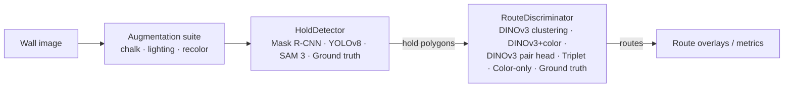
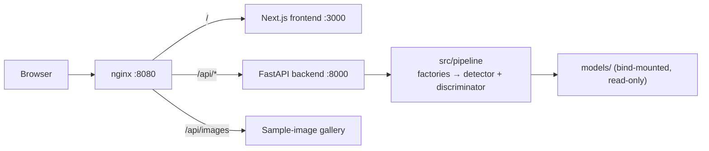

# Robust Indoor Climbing Route Recognition

**ROUTNet**: a modular computer-vision pipeline and interactive web demo that
finds climbing holds in a photo of a bouldering wall and groups them into
routes. It also measures how robust that grouping is to chalk, lighting, and
similar-color distortions.

Joswin Dsouza · Macallyster Edmondson  · Praveen Narayan Hegde

Department of Computer Science, UTN (2026)


---

## Contents

1. [Motivation and research question](#1-motivation-and-research-question)
2. [Results at a glance](#2-results-at-a-glance)
3. [System overview](#3-system-overview)
4. [Methods](#4-methods)
5. [Data](#5-data)
6. [Models and weights](#6-models-and-weights)
7. [Installation](#7-installation)
8. [Running the web demo](#8-running-the-web-demo)
9. [Reproducing the experiments](#9-reproducing-the-experiments)
10. [Repository structure](#10-repository-structure)
11. [Configuration reference](#11-configuration-reference)
12. [Known issues and limitations](#12-known-issues-and-limitations)
13. [Acknowledgements and licenses](#13-acknowledgements-and-licenses)

---

## 1. Motivation and research question

**What is a route?** In bouldering, a *route* (or "problem") is a set of holds
chosen by a route setter. In most gyms all its holds share **one color**. Tape
marks the start hold and a top hold marks the finish. Climbers may use only
holds of that color, while sculpted *volumes* and the wall itself are shared
by every route. A single wall carries several interleaved routes (5.5 per
image in our labeled set) and is reset every few weeks. Route membership is
therefore a **color convention**, not a geometric property.

**Why it is hard.** The task combines three difficulties:

1. **Dense instance segmentation** of small, irregular objects on textured
   walls. Our held-out set averages 96 holds per image, ranging from
   few-pixel footholds to large volumes.
2. **Open-set grouping.** The number of routes is unknown, and colors are not
   a fixed vocabulary.
3. **A corruptible cue.** Chalk whitens holds, shoe rubber darkens them,
   overhangs cast shadows, and camera white balance shifts hue. Neighboring
   routes often use confusable hues.

Color thresholding is brittle under these conditions. Learned same-route
classifiers ([Soni, 2025][soni]) need route labels from the same kind of gym.

**Research question.** *Do pretrained visual embeddings, combined with color,
identify indoor climbing routes more robustly than color-based grouping under
chalk, lighting, and similar-color distortions?*

| Hypothesis | Statement | Status |
|---|---|---|
| H1 | DINOv3+color degrades less than color-only under distortion | **Pending** (benchmark not run) |
| H2 | Color-only is competitive on clean, well-separated routes | **Pending** (benchmark not run) |
| H3 | A general segmentation foundation model (SAM 3) does not already solve hold detection zero-shot | **Supported** (Section 2) |

---

## 2. Results at a glance

TODO
---

## 3. System overview

The system has two stages behind stable interfaces. A `HoldDetector` finds
holds, and a `RouteDiscriminator` groups them. Either stage can be swapped
without touching the other. Ground-truth implementations of both stages let
the grouping stage be evaluated without detection errors.



The web demo runs the **same** pipeline code:



Interface contracts use MUST/SHOULD/MAY language and are specified in
[`docs/spec/pipeline/README.md`](docs/spec/pipeline/README.md).

---

## 4. Methods

### 4.1 Hold detectors (`src/pipeline/hold_detector/`)

| Registry name | Class | Description | Output |
|---|---|---|---|
| `Mask-RCNN` | `MaskRCNNHoldDetector` | Original Detectron2 config and weights from the Kaggle release of [xiaoxiae][xiaoxiae]; inference-only; volumes dropped by default (`include_volumes=False`) | instance polygons |
| `YOLO` | `YOLOv8HoldDetector` | YOLOv8s trained by us (Section 10.3) | axis-aligned boxes as 4-point polygons |
| `SAM 3` | `SAMHoldDetector` | Zero-shot text prompt plus an optional ordered list of `(image, mask)` exemplars; each exemplar is run independently and merged by confidence-ordered mask-IoU NMS (`nms_iou=0.85`) | instance polygons |
| `Ground Truth` | `GroundTruthHoldDetector` | Replays annotations for images that match the evaluation set by exact pixel hash | annotated polygons |
| `Mock` | `MockHoldDetector` | Random polygons for UI and pipeline tests | random polygons |

### 4.2 Route discriminators (`src/pipeline/route_discriminator/`)

All DINOv3-based methods share one feature extractor
([`utility/dinov3.py`](src/pipeline/utility/dinov3.py)):

- **Backbone:** frozen DINOv3 ViT-S/16 (`facebook/dinov3-vits16-pretrain-lvd1689m`,
  384-d tokens, 4 register tokens discarded).
- **Input:** the image is resized to 1280×1280 without center cropping, giving
  80×80 = 6,400 patch tokens.
- **Hold embedding:** patch tokens are averaged with weights equal to the
  hold mask's coverage of each patch, then L2-normalized:
  `e_i = norm(Σ_p a_ip · z_p / Σ_p a_ip)`.
- **Hold color:** `c_i` is the median CIELAB color inside the hold polygon.

|Class | Method | Labels needed |
|---|---|---|
| `ColorOnlyRouteDiscriminator` | Deterministic k-means on mean RGB or CIELAB hold color; `n_clusters` must be given | none (needs *k*) |
| `DINOClusteringRouteDiscriminator` | Cosine distance between embeddings, optionally fused with CIEDE2000: `d_ij = [(1 − e_iᵀe_j) + w·ΔE00(c_i,c_j)/100] / (1 + w)` (`color_weight = w`, default 0). Clustered with HDBSCAN (default, `min_cluster_size=2`), DBSCAN (`eps=0.3`), or agglomerative (`distance_threshold=0.3`, `linkage="average"`). Noise holds become single-hold routes. | none (no *k*) |
| `DINOLearningRouteDiscriminator` | MLP pair head (775 → 128 → 1) on `[abs(e_i − e_j), e_i ⊙ e_j, φ_ij]`, where `φ_ij` holds ΔE00, `abs(c_i − c_j)`, and `(c_i + c_j)/2`. Pairs with `p ≥ pair_threshold` (0.5) are merged by union–find. | 8 route-labeled images |
| `TripletRouteDiscriminator` | Pretrained ResNet-50 → 256-d L2-normalized embeddings of masked crops ([Soni][soni], [xiaoxiae][xiaoxiae]); greedy assignment when the median squared distance is ≤ 0.7 and the maximum is ≤ 2.65 | supervised (Kaggle) |
| `GroundTruthRouteDiscriminator` | Replays annotated routes (pixel-hash match) | — |


### 4.3 Augmentation suite (`src/pipeline/preprocessing/augmentation_suite.py`)

The suite is deterministic and mask-aware and never mutates its input. An
`AugmentationPlan` applies its recipes in order, and each chalk recipe gets its
own seed derived from `(plan seed, recipe index)`.

| Recipe | Parameters | Effect |
|---|---|---|
| `ChalkAugmentation` | per-hold strength `s ∈ [0,1]` | Coarse noise at 1/24 resolution, upscaled bicubically and squared, is blended toward white. It is luminance-gated (no chalk below 10% luminance, full chalk above 40%), so bolt holes stay dark. |
| `LightingAugmentation` | `ℓ ∈ [−1,1]` | Global brightness scaled by `(1 + ℓ)`; −1 is black and 0 is unchanged |
| `ColorAugmentation` | per-hold `RGBColor` | Hue and saturation are replaced while local lightness variation is kept, which simulates similar-color neighboring routes |

### 4.4 Evaluation protocol

- **Detection:** #Need to write
- **Grouping (planned):** #Need to write
---

## 5. Data

| Set | Source | Images | Content | Used for | In repo? |
|---|---|---:|---|---|---|
| `bh` route-labeled subset | [Kaggle][kaggle] v4 | 8 (`0003, 0074, 0075, 0457, 0502, 0518, 0530, 0917`) | 587 route-labeled holds, 17 routes | DINOv3 pair-head training (6 train / 2 val) | no (download) |
| `bh` 0000–0008 | [Kaggle][kaggle] | 9 (2800×1864) | 389 `hold` polygons, plus `volume` polygons | Common detection test (SAM 3) | yes: `data/evaluation/images/` + `bh-annotation.csv` (VIA) |
| SAM 3 exemplars | ours | 5 pairs | clean single-hold image and mask pairs | SAM 3 exemplar prompts | yes: `data/evaluation/exemplars/` |
| `bh-phone` 000–014 | [Kaggle][kaggle] | 15 | — | Mask R-CNN reproduction and timing | no (download) |
| Roboflow `hold-detection-havfy` v2 | Roboflow (**TODO: add URL, license, image counts**) | TODO | one class, `Hold` (YOLOv8 format) | YOLOv8 train/val/test | no (download to `data/roboflow_dataset/`) |
| Held-out route set | ours (Nuremberg Gym) | 14 | 1,347 holds; 825 route-labeled; 522 unlabeled (129 marked `Unknown`); 72 routes (13 images carry routes) | Route-grouping benchmark | yes: `data/evaluation/ground_truth_labels/` |


**Ground-truth format**
(`data/evaluation/ground_truth_labels/bouldering_holds_restructured.json`):
COCO-style JSON with one annotation per physical hold. Each annotation has a
polygon in `segmentation`, a `route_id` (`"route_N"` or `null`), and a
`route_label` (keeps `"Unknown"`). Route polygons were matched to generic
hold polygons by one-to-one box IoU ≥ 0.5. **Route IDs are local to each
image**: the same `route_3` label on two images refers to different routes.
Load it with `pipeline.utility.ground_truth_loader.load_coco_restructured`.

**Downloading the Kaggle data** :

```bash
uv run --with kagglehub python - <<'PY'
import kagglehub
path = kagglehub.dataset_download("tomasslama/indoor-climbing-gym-hold-segmentation")
print(path)   # copy or symlink the `bh` split to data/bh (images + annotation.json)
PY
```
---

## 6. Models and weights

All weights live in `models/` and are tracked with **Git LFS** (`*.pt`,
`*.pth`, `*.safetensors`). Run `git lfs pull` after cloning. The backend
container bind-mounts `models/` read-only.

| Path | Size | What | Origin |
|---|---:|---|---|---|
| `models/mask_rcnn_hold_detector/model_final.pth` + `experiment_config.yml` | 427 MB (folder) | Detectron2 Mask R-CNN (classes: hold, volume) | Kaggle dataset's `model/` folder ([xiaoxiae][xiaoxiae]) |
| `models/mask_rcnn_hold_detector/triplet_network_final.pt` | (in folder) | ResNet-50 triplet embedding | same |
| `models/yolov8_hold_detector/best.pt` | 22 MB | YOLOv8s hold detector (epoch 13) | trained by us | AGPL-3.0 (Ultralytics) |
| `models/dinov3/` | 82 MB | `facebook/dinov3-vits16-pretrain-lvd1689m` | Hugging Face (gated) |
| `models/sam3/` (4 shards) | 3.2 GB | `facebook/sam3` (`Sam3VideoModel`) | Hugging Face (gated); split into shards under 1 GB for LFS with [`shard_original_image.py`](models/sam3/shard_original_image.py) |
| `models/dino_learning_route_discriminator.pt` + `.json` | 392 KB | DINOv3 pair head and training summary | trained by us |

To re-download the gated backbones instead of using LFS :

```bash
uvx --from huggingface_hub hf auth login
uvx --from huggingface_hub hf download facebook/dinov3-vits16-pretrain-lvd1689m --local-dir models/dinov3
uvx --from huggingface_hub hf download facebook/sam3 --local-dir models/sam3
uv run python models/sam3/shard_original_image.py models/sam3/model.safetensors  # optional: LFS-sized shards
```

---

## 7. Installation

### 7.1 Prerequisites

| Tool | Version used | Needed for |
|---|---|---|
| Python | **3.12** (the local `.venv` and Docker images use 3.12.10 and 3.12) | pipeline, backend, training |
| [uv](https://docs.astral.sh/uv/) | latest | dependency management (`uv.lock`) |
| Git LFS | latest | model weights and evaluation images |
| Node.js / npm | 24.18.1 (`src/frontend/.nvmrc`; the Docker image uses Node 22) | frontend development |
| Docker + Docker Compose | latest | one-command demo |
| CUDA GPU | optional (experiments used one NVIDIA A40) | SAM 3 and training in reasonable time |

### 7.2 Python environment

```bash
git clone https://github.com/mac-edmondson/zero-shot-route-segmentation.git
cd zero-shot-route-segmentation
git lfs install && git lfs pull

uv python pin 3.12          # .python-version currently says 3.14; 3.12 is what was tested
uv sync                     # installs torch, transformers, ultralytics, hdbscan, detectron2 (built from git)
uv pip install scikit-learn # needed for DBSCAN/agglomerative clustering; not yet in pyproject.toml
```

Detectron2 is compiled from source against the installed PyTorch
(`[tool.uv.extra-build-dependencies]`), so a C++ toolchain is required
(`build-essential` on Linux, Xcode Command Line Tools on macOS). If you don't
need Mask R-CNN, the other detectors work without it.

### 7.3 Frontend

```bash
cd src/frontend
nvm use            # Node 24.18.1
npm ci
cp .env.local.example .env.local   # then edit, see Section 13
```

---

## 8. Running the web demo

### 8.1 Docker Compose (recommended)

```bash
# Linux
docker compose up --build
# macOS (uses the IPv4-only nginx resolver config)
./compose-up-mac.sh
```

Then open **http://localhost:8080**.

- **Default launch:** `docker-compose.override.yaml` is loaded automatically.
  It builds the backend's `base` stage (CPU PyTorch) and proxies the sample
  gallery at `/api/images/` to the external image server.
- **Production:** run `docker compose -f docker-compose.yaml up --build`. This
  builds the `production` stage, and nginx serves the gallery from
  `${GALLERY_PATH:-./data/evaluation}`.
- **Speed:** the Docker backend runs on CPU, so the first SAM 3 request loads
  3.2 GB of weights and is slow.

### 8.2 Local development (without Docker)

```bash
# Terminal 1: backend
uv run uvicorn src.backend.main:app --reload --port 8000
# Terminal 2: frontend (set NEXT_PUBLIC_USE_MOCK_API=false and NEXT_PUBLIC_API_BASE_URL=http://localhost:8000)
cd src/frontend && npm run dev   # http://localhost:3000
```

With `NEXT_PUBLIC_USE_MOCK_API=true` the frontend runs entirely on an
in-memory mock client, so no backend is needed.

### 8.3 Demo workflow

1. **Upload:** load a wall image from a local file, the webcam, or the sample
   gallery.
2. **Augment:** click holds to segment them with SAM 3 point prompts. Apply
   per-hold chalk and recoloring and global lighting. These are previewed live
   and then baked in server-side by the same augmentation suite used in
   experiments.
3. **Recognition:** pick a hold detector and a route discriminator, run
   inference, and view the route overlays together with hold and route counts.

### 8.4 REST API (`src/backend/routes/`)

The backend is stateless with respect to storage: sessions are in memory and
tracked with a cookie. Long-running work is queued, returns `202`, and is
polled with the matching `GET`.

| Method | Path | Purpose |
|---|---|---|
| `GET` | `/health` | Liveness check |
| `PUT` / `GET` | `/image/working` | Set or read the session's working image |
| `POST` / `GET` | `/image/working/segment` | Start or poll SAM 3 click-point segmentation |
| `DELETE` | `/image/working/segment/{segment_id}` | Remove a segment |
| `POST` | `/image/working/augment` | Apply chalk, recolor, and lighting to the working image |
| `GET` | `/pipeline/available_configs` | List registered detectors and discriminators |
| `GET` / `PUT` | `/pipeline` | Read or set the session's detector/discriminator pair |
| `POST` / `GET` | `/pipeline/infer/working` | Start or poll full pipeline inference (routes, polygons, counts) |


---
## 09. Reproducing the experiments

  'Need to be written

---

## 10. Repository structure

```
zero-shot-route-segmentation/
├── README.md                     ← this file
├── pyproject.toml, uv.lock       Python dependencies (uv)
├── docker-compose*.yaml          demo stack (nginx + frontend + backend); compose-up-mac.sh
├── data/
│   └── evaluation/
│       ├── images/               9 Kaggle bh images + VIA CSV (SAM 3 detection test)
│       ├── exemplars/            5 SAM 3 exemplar image/mask pairs
│       └── ground_truth_labels/  14 held-out images + route-labeled COCO JSON
├── docs/
│   ├── evaluation.md             experiment log (SAM 3, Mask R-CNN checks)
│   ├── updates.md                pipeline API notes, DINO training data
│   ├── diagrams/                 experiment pipeline and REST API diagrams (draw.io)
│   └── spec/pipeline/            interface specifications (MUST/SHOULD/MAY)
├── models/                       weights (Git LFS), see Section 6
├── report/                       short paper (NeurIPS 2026 template), proposal, feedback, rubric
├── src/
│   ├── pipeline/
│   │   ├── interfaces/           shared data models (Coordinate, Polygon, Hold, Route, ...) and errors
│   │   ├── hold_detector/        Mask R-CNN, YOLOv8, SAM 3, ground truth, mock + factory
│   │   ├── route_discriminator/  color-only, DINOv3 clustering/learning, triplet, ground truth, mock + factory
│   │   ├── preprocessing/        augmentation suite, dataset providers
│   │   ├── utility/              DINOv3 extractor, pair head, SAM 3 wrappers, GT loader
│   │   └── route_discriminator_pipeline.py
│   ├── backend/                  FastAPI app (routes/, services/, schemas.py, session_store.py, Dockerfile)
│   ├── frontend/                 Next.js 16 / React 19 app (app/, components/, lib/api/)
│   ├── nginx/                    reverse-proxy configs (prod, dev, dev-mac)
│   └── tests/                    pytest suite
└── training/
    ├── dino_learning_route_discriminator.py
    └── yolov8-hold-detector/     trainer, run artifacts (train/, eval/), checkpoints/
```

---

## 11. Configuration reference

| Variable | Where | Default | Meaning |
|---|---|---|---|
| `NEXT_PUBLIC_API_BASE_URL` | frontend (build time) | `/api` (Docker), `http://localhost:8000` (example) | Backend base URL |
| `NEXT_PUBLIC_USE_MOCK_API` | frontend (build time) | `false` (Docker), `true` (example) | Use the in-memory mock client |
| `NEXT_PUBLIC_MOCK_GALLERY_BASE_URL` | frontend | external image server | Gallery thumbnails in mock mode |
| `FRONTEND_ORIGIN` | backend | `http://localhost:3000` | Allowed CORS origin |
| `SESSION_COOKIE_SECURE` | backend | `true` (prod), `false` (dev override) | `Secure` flag on the session cookie |
| `GALLERY_PATH` | nginx (prod) | `./data/evaluation` | Directory served as the sample gallery |

---

## 12. Known issues and limitations

#If we want to write this section then need to be written else can skip it

---

## 13. Acknowledgements and licenses

- **Climbing data and models:** Mask R-CNN weights, the triplet network, and
  the Kaggle climbing dataset come from T. Sláma / xiaoxiae
  ([code][xiaoxiae], [data][kaggle]). **TODO: state the dataset license.**
- **DINOv3:** © Meta, used under the [DINOv3 License](models/dinov3/LICENSE.md).
- **SAM 3:** © Meta, used under its Hugging Face model license
  (**TODO: verify and link**).
- **Detectron2:** Apache-2.0.
- **Ultralytics YOLOv8:** AGPL-3.0.
- **Teaching team:** the UTN Computer Vision teaching team gave feedback that
  shaped the SAM 3 baseline and the evaluation design.
- **LLM use:** LLM coding assistants were used during development, as the
  course allows. The authors are responsible for all code and results.

[soni]: report/references.bib "R. Soni, AI-driven Route Mapping for Indoor Climbing: A Computer Vision Approach, MEDCOM 2025, pp. 195–202"
[xiaoxiae]: https://github.com/xiaoxiae/Indoor-Climbing-Hold-and-Route-Segmentation
[kaggle]: https://www.kaggle.com/datasets/tomasslama/indoor-climbing-gym-hold-segmentation
