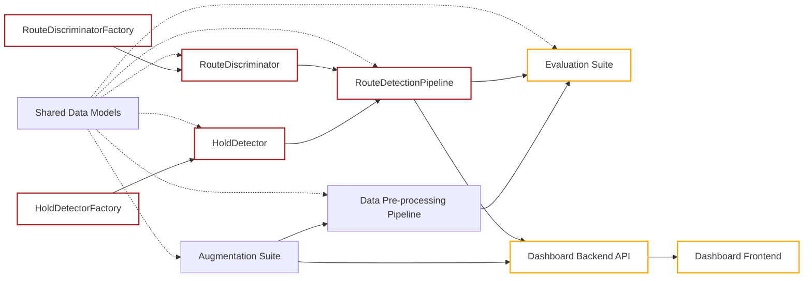

# Route Detection Software Interface Specifications

**Scope:** Software boundaries, public interfaces, data contracts, and component relationships.
**Normative language:** **MUST**, **SHOULD**, and **MAY** indicate required, recommended, and optional behavior, respectively.

## System Description

The system is organized around a two-stage perception pipeline:

1. [HoldDetector](interfaces/hold-detector.md) extracts climbing holds from one or more wall images.
2. [RouteDiscriminator](interfaces/route-discriminator.md) groups those holds into one or more routes.

[RouteDetectionPipeline](interfaces/route-detection-pipeline.md) composes the two while deliberately exposing the underlying components for composability within the demo dashboard and evaluation suite.

[AugmentationSuite](interfaces/augmentation-suite.md) and [DataPreprocessingPipeline](interfaces/data-preprocessing-pipeline.md) create clean/distorted evaluation inputs. The [Dashboard Backend](interfaces/dashboard-backend.md) invokes the same core pipeline and evaluation interfaces used by offline tooling; the [Dashboard Frontend](interfaces/dashboard-frontend.md) is a client of that backend.

In the above diagram dependencies point inwards; colors are defined by:

- Blue   :: Helper Components
- Red    :: Pipeline Components
- Orange :: End-use-cases

## Specifications

| Piece | Specification | Primary role |
| --- | --- | --- |
| Shared Data Models | [interfaces/data-models.md](interfaces/data-models.md) | General data models used throughout specifications. E.g. `Coordinate`, `Polygon`, `RGBColor`, `Hold`, `Route`, image/result envelopes, etc. |
| Hold detection | [interfaces/hold-detector.md](interfaces/hold-detector.md) | Detect holds in wall images |
| Hold detector creation | [interfaces/hold-detector-factory.md](interfaces/hold-detector-factory.md) | Select/configure a hold detector implementation |
| Route classification | [interfaces/route-discriminator.md](interfaces/route-discriminator.md) | Group detected holds into routes |
| Route discriminator creation | [interfaces/route-discriminator-factory.md](interfaces/route-discriminator-factory.md) | Select/configure a route discriminator implementation |
| Core pipeline | [interfaces/route-detection-pipeline.md](interfaces/route-detection-pipeline.md) | Compose hold detection and route classification |
| Augmentation | [interfaces/augmentation-suite.md](interfaces/augmentation-suite.md) | Create lighting/chalk/color distortions and materialized image variants |
| Data pre-processing | [interfaces/data-preprocessing-pipeline.md](interfaces/data-preprocessing-pipeline.md) | Produce evaluation datasets or on-the-fly dataset providers |
| Evaluation | [interfaces/evaluation-suite.md](interfaces/evaluation-suite.md) | Evaluate pipeline and individual components, gather results |
| Dashboard backend | [interfaces/dashboard-backend.md](interfaces/dashboard-backend.md) | Expose prediction/evaluation workflows through an API |
| Dashboard frontend | [interfaces/dashboard-frontend.md](interfaces/dashboard-frontend.md) | Demo UI for uploads, predictions, evaluation runs, and results |

## Suggested implementation order

TODO: Remove me

1. Stabilize [shared data models](interfaces/data-models.md).
2. Implement protocols and factories for [HoldDetector](interfaces/hold-detector.md), [HoldDetectorFactory](interfaces/hold-detector-factory.md), [RouteDiscriminator](interfaces/route-discriminator.md), and [RouteDiscriminatorFactory](interfaces/route-discriminator-factory.md).
3. Compose them in [RouteDetectionPipeline](interfaces/route-detection-pipeline.md).
4. Implement [AugmentationSuite](interfaces/augmentation-suite.md) and [DataPreprocessingPipeline](interfaces/data-preprocessing-pipeline.md).
5. Implement [EvaluationSuite](interfaces/evaluation-suite.md).
6. Put [Dashboard Backend](interfaces/dashboard-backend.md) and [Dashboard Frontend](interfaces/dashboard-frontend.md) over the stable pipeline/evaluation contracts.
