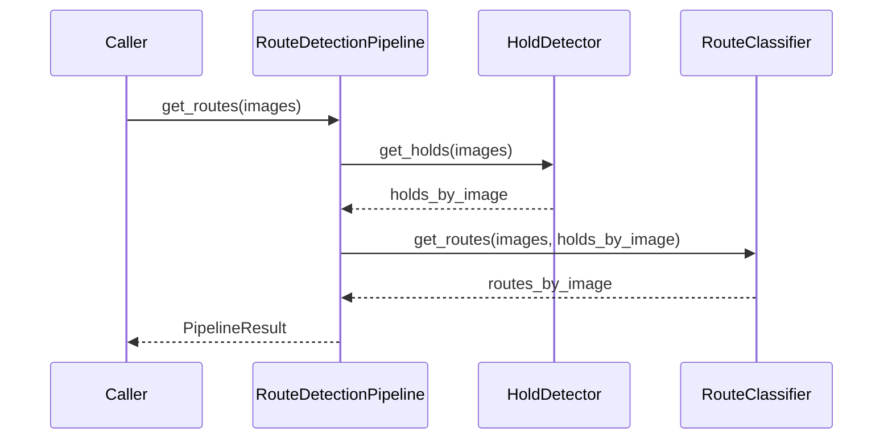

# RouteDetectionPipeline Interface

TODO: Port to code and clean

**Composes:** [HoldDetector](hold-detector.md) + [RouteClassifier](route-classifier.md)
**Consumed by:** [EvaluationSuite](evaluation-suite.md), [Dashboard Backend](dashboard-backend.md)

## 1. Responsibility

Provide the canonical end-to-end inference entry point while retaining direct access to the two component stages for individual evaluation.

## 2. Construction

```python
from dataclasses import dataclass
from typing import Sequence
from .data_models import Image, PipelineResult
from .hold_detector import HoldDetector
from .route_classifier import RouteClassifier

@dataclass
class RouteDetectionPipeline:
    hold_detector: HoldDetector
    route_classifier: RouteClassifier

    def run(self, images: Sequence[Image]) -> PipelineResult: ...
```

A convenience constructor MAY use [HoldDetectorFactory](hold-detector-factory.md) and [RouteClassifierFactory](route-classifier-factory.md), but dependency injection of already-created components SHOULD remain supported for testing and evaluation.

## 3. Inference flow



## 4. Pipeline identity

The pipeline SHOULD expose a serializable descriptor.

[EvaluationSuite](evaluation-suite.md) MUST persist this descriptor with results.
