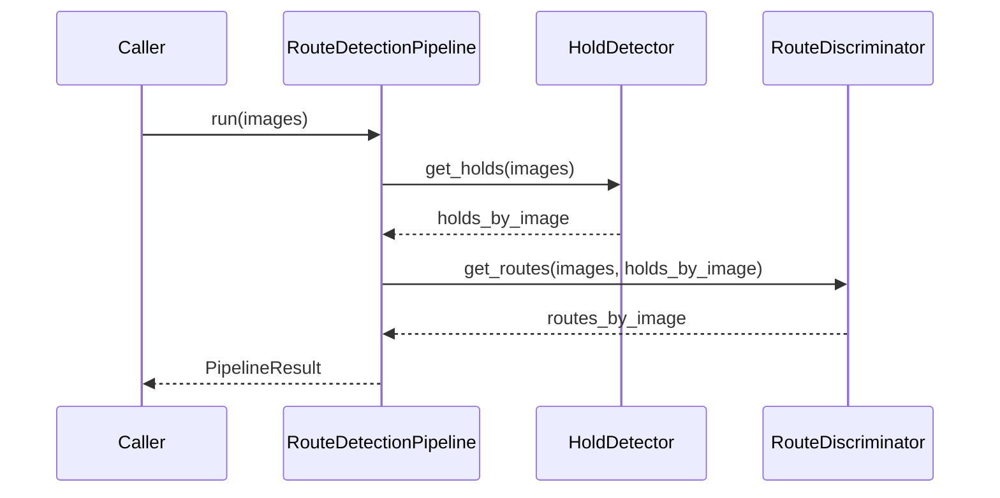

# RouteDetectionPipeline Interface

TODO: Port to code and clean

**Composes:** [HoldDetector](hold-detector.md) + [RouteDiscriminator](route-discriminator.md)
**Consumed by:** [EvaluationSuite](evaluation-suite.md), [Dashboard Backend](dashboard-backend.md)

## 1. Responsibility

Provide the canonical end-to-end inference entry point while retaining direct access to the two component stages for individual evaluation.

## 2. Construction

```python
from dataclasses import dataclass
from typing import Sequence
from .data_models import Image, PipelineResult
from .hold_detector import HoldDetector
from .route_discriminator import RouteDiscriminator

@dataclass
class RouteDetectionPipeline:
    hold_detector: HoldDetector
    route_discriminator: RouteDiscriminator

    def run(self, images: Sequence[Image]) -> PipelineResult: ...
```

A convenience constructor MAY use [HoldDetectorFactory](hold-detector-factory.md) and [RouteDiscriminatorFactory](route-discriminator-factory.md), but dependency injection of already-created components SHOULD remain supported for testing and evaluation.

## 3. Inference flow



## 4. Required behavior

`run(images)` MUST:

1. pass the exact input image batch to `hold_detector.get_holds`;
2. verify returned batch alignment;
3. pass the same image batch plus detector output to `route_discriminator.get_routes`;
4. verify returned batch alignment;
5. return detections and routes associated with each original image.

The pipeline MUST NOT hide the configured detector/classifier from [EvaluationSuite](evaluation-suite.md), because the board explicitly calls for evaluating individual pieces as well as whole pipelines.

## 5. Optional visualization

Visualization SHOULD remain outside core inference. Callers can use:

- `HoldDetector.mark_holds(...)` for hold-level overlays;
- `RouteDiscriminator.mark_routes(...)` or `Route.mark_route(...)` for route overlays.

The [Dashboard Backend](dashboard-backend.md) MAY expose a convenience endpoint that produces both.

## 6. Pipeline identity

The pipeline SHOULD expose a serializable descriptor:

```python
@dataclass(frozen=True)
class PipelineDescriptor:
    detector_id: str
    detector_config: dict
    discriminator_id: str
    classifier_config: dict
```

[EvaluationSuite](evaluation-suite.md) MUST persist this descriptor with results.
