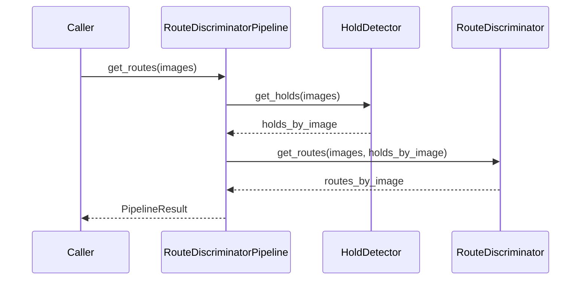

# RouteDiscriminatorPipeline Interface

**Composes:** [HoldDetector](hold-detector.md) + [RouteDiscriminator](route-discriminator.md)
**Consumed by:** [EvaluationSuite](evaluation-suite.md), [Dashboard Backend](dashboard-backend.md)

## 1. Responsibility

Provide the canonical end-to-end inference entry point while retaining direct access to the two component stages for individual evaluation.

## 2. Interface Contract, self-documenting

Implementation: [/src/pipeline/route_discriminator_pipeline.py](/src/pipeline/route_discriminator_pipeline.py)

## 3. Inference flow

## 4. Pipeline identity

The pipeline SHOULD expose a serializable descriptor.

[EvaluationSuite](evaluation-suite.md) MUST persist this descriptor with results.
